<!--
  ┌──────────────────────────────────────────────────────────────────┐
  │  Every image on this page is generated from profile/content.json │
  │  Edit that file → push → GitHub Actions rebuilds the artwork.    │
  └──────────────────────────────────────────────────────────────────┘
-->

<a href="https://mahmoudaladin.netlify.app/">
  <picture>
    <source media="(max-width: 767px) and (prefers-color-scheme: dark)" srcset="assets/hero-mobile-dark.svg">
    <source media="(max-width: 767px)" srcset="assets/hero-mobile-light.svg">
    <source media="(prefers-color-scheme: dark)" srcset="assets/hero-dark.svg">
    
  </picture>
</a>

  <a href="https://mahmoudaladin.netlify.app/"><picture><source media="(prefers-color-scheme: dark)" srcset="assets/btn-portfolio-dark.svg"></picture></a>
  <a href="https://www.linkedin.com/in/mahmoud-aladin-b0b903274/"><picture><source media="(prefers-color-scheme: dark)" srcset="assets/btn-linkedin-dark.svg">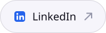</picture></a>
  <a href="mailto:mahmoudaladin7@gmail.com"><picture><source media="(prefers-color-scheme: dark)" srcset="assets/btn-email-dark.svg"></picture></a>

 

### `01` &nbsp;About

I'm a **full-stack software engineer** and **Lead Web Developer** who builds and runs production websites and web apps across multiple businesses. I own the work from the first requirements and technical decisions through launch and ongoing production support.

Since January 2026 I've led web at **Wealth Basis Holding Company (WBHC)** in Jeddah. I own technical delivery for the group's sites: WBHC, Future Vision, Smart Details, Tala Line and Logistics Gateway. My work spans frontend and backend, CMS and third-party integrations, deployment, technical SEO, analytics, performance and security.

- ⚙️ &nbsp;**Backend** — NestJS · Node.js · Django · Spring Boot → auth, REST & GraphQL, query tuning
- 🖥️ &nbsp;**Frontend** — Next.js · React · TypeScript · Tailwind → i18n with full RTL / LTR support
- 📱 &nbsp;**Mobile** — Flutter apps for Android & iOS
- ☁️ &nbsp;**Ops** — Docker · Kubernetes · AWS · Vercel · Linux

 

### `02` &nbsp;Featured work

<!-- projects:start -->

  <a href="https://www.wbhc.com.sa/en" target="_blank" rel="noopener noreferrer"><picture><source media="(max-width: 767px) and (prefers-color-scheme: dark)" srcset="assets/project-1-mobile-dark.svg"><source media="(max-width: 767px)" srcset="assets/project-1-mobile-light.svg"><source media="(prefers-color-scheme: dark)" srcset="assets/project-1-dark.svg"></picture></a>
  <a href="https://www.talaline.sa/ar" target="_blank" rel="noopener noreferrer"><picture><source media="(max-width: 767px) and (prefers-color-scheme: dark)" srcset="assets/project-2-mobile-dark.svg"><source media="(max-width: 767px)" srcset="assets/project-2-mobile-light.svg"><source media="(prefers-color-scheme: dark)" srcset="assets/project-2-dark.svg"></picture></a>

  <a href="https://www.smartdetails.sa/" target="_blank" rel="noopener noreferrer"><picture><source media="(max-width: 767px) and (prefers-color-scheme: dark)" srcset="assets/project-3-mobile-dark.svg"><source media="(max-width: 767px)" srcset="assets/project-3-mobile-light.svg"><source media="(prefers-color-scheme: dark)" srcset="assets/project-3-dark.svg"></picture></a>
  <a href="https://logistic-gateway.com/" target="_blank" rel="noopener noreferrer"><picture><source media="(max-width: 767px) and (prefers-color-scheme: dark)" srcset="assets/project-4-mobile-dark.svg"><source media="(max-width: 767px)" srcset="assets/project-4-mobile-light.svg"><source media="(prefers-color-scheme: dark)" srcset="assets/project-4-dark.svg"></picture></a>

  <a href="https://www.future-vision-sa.com/" target="_blank" rel="noopener noreferrer"><picture><source media="(max-width: 767px) and (prefers-color-scheme: dark)" srcset="assets/project-5-mobile-dark.svg"><source media="(max-width: 767px)" srcset="assets/project-5-mobile-light.svg"><source media="(prefers-color-scheme: dark)" srcset="assets/project-5-dark.svg"></picture></a>
  <a href="https://bjeek.com" target="_blank" rel="noopener noreferrer"><picture><source media="(max-width: 767px) and (prefers-color-scheme: dark)" srcset="assets/project-6-mobile-dark.svg"><source media="(max-width: 767px)" srcset="assets/project-6-mobile-light.svg"><source media="(prefers-color-scheme: dark)" srcset="assets/project-6-dark.svg"></picture></a>

<!-- projects:end -->

 

### `03` &nbsp;Experience

<picture>
  <source media="(max-width: 767px) and (prefers-color-scheme: dark)" srcset="assets/experience-mobile-dark.svg">
  <source media="(max-width: 767px)" srcset="assets/experience-mobile-light.svg">
  <source media="(prefers-color-scheme: dark)" srcset="assets/experience-dark.svg">
  
</picture>

 

### `04` &nbsp;Toolbox

<picture>
  <source media="(max-width: 767px) and (prefers-color-scheme: dark)" srcset="assets/toolbox-mobile-dark.svg">
  <source media="(max-width: 767px)" srcset="assets/toolbox-mobile-light.svg">
  <source media="(prefers-color-scheme: dark)" srcset="assets/toolbox-dark.svg">
  
</picture>

 

### `05` &nbsp;Live from GitHub

<picture>
  <source media="(max-width: 767px) and (prefers-color-scheme: dark)" srcset="https://raw.githubusercontent.com/mahmoudaladin7/mahmoudaladin7/output/stats-mobile-dark.svg">
  <source media="(max-width: 767px)" srcset="https://raw.githubusercontent.com/mahmoudaladin7/mahmoudaladin7/output/stats-mobile-light.svg">
  <source media="(prefers-color-scheme: dark)" srcset="https://raw.githubusercontent.com/mahmoudaladin7/mahmoudaladin7/output/stats-dark.svg">
  
</picture>

<picture>
  <source media="(prefers-color-scheme: dark)" srcset="https://raw.githubusercontent.com/mahmoudaladin7/mahmoudaladin7/output/snake-dark.svg">
  
</picture>

  

<a href="mailto:mahmoudaladin7@gmail.com">
  <picture>
    <source media="(max-width: 767px) and (prefers-color-scheme: dark)" srcset="assets/footer-mobile-dark.svg">
    <source media="(max-width: 767px)" srcset="assets/footer-mobile-light.svg">
    <source media="(prefers-color-scheme: dark)" srcset="assets/footer-dark.svg">
    
  </picture>
</a>

  

